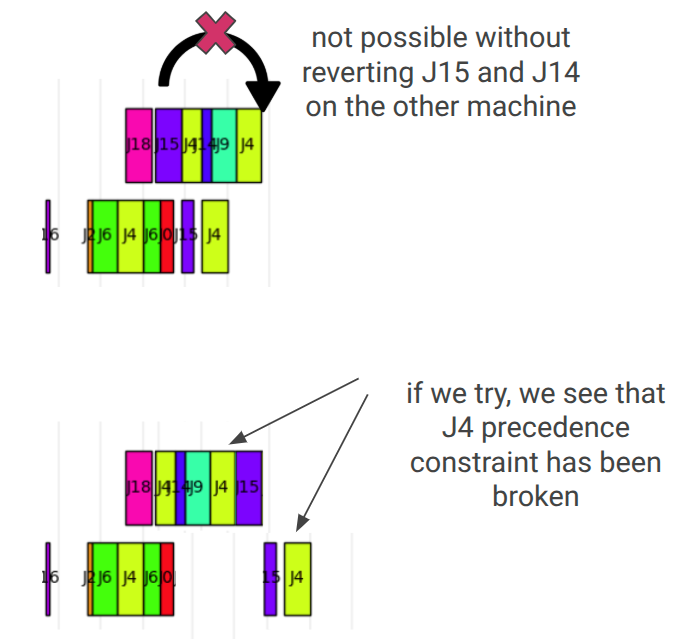
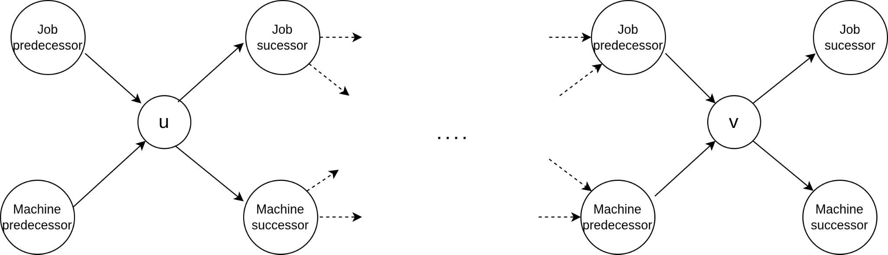
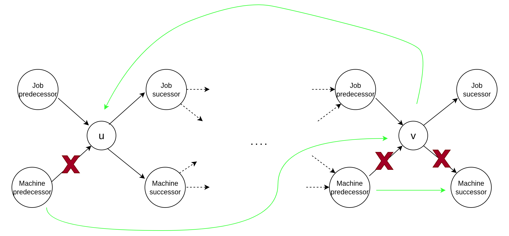
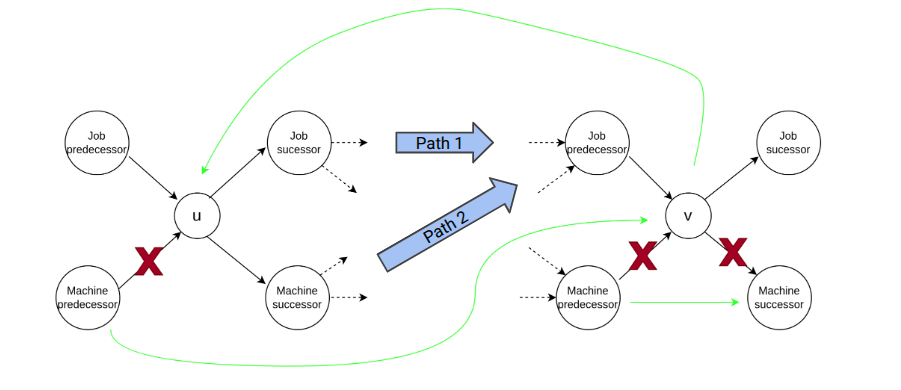

# Documentation

## Glossary

**Action Mask**: Boolean array indicating which actions are valid for each operation. Shape `(num_operations, 2)` where column 0 represents left moves and column 1 represents right moves.

**Adjacency Matrix**: Graph representation where `adj_mat[i][j]` contains the weight of the edge from node i to node j. Used for both precedence constraints (PC) and machine constraints (MC).

**Block ID**: Unique identifier assigned to each critical block. Operations belonging to the same critical block share the same block ID.

**Critical Block**: Maximal sequence of consecutive critical operations processed on the same machine. Operations within a block can potentially be reordered without affecting other machines.

**Critical Operation**: An operation on the critical path where `earliest_start_time == latest_start_time`, meaning any delay would increase the makespan.

**Critical Path**: The longest path from source to target in the disjunctive graph representation. This path determines the makespan and contains all operations that cannot be delayed.

**Disjunctive Graph**: Graph representation of job shop scheduling where nodes are operations and edges represent constraints. Precedence edges are fixed, machine edges can be oriented.

**EST (Earliest Start Time)**: The earliest possible start time for an operation, considering all precedence constraints.

**Gap Left/Right**: Time buffer between consecutive operations on the same machine. Gap left is the idle time before an operation, gap right is the idle time after.

**Job Precedence**: Constraint that operations within the same job must be processed in a specific order (typically sequential).

**LST (Latest Start Time)**: The latest possible start time for an operation without increasing the makespan.

**Machine Constraint**: Constraint that operations on the same machine cannot overlap in time and must be processed in some sequential order.

**Makespan**: Total completion time of the schedule, measured from start to the completion of the last operation.

**Neighborhood**: In local search, the set of all schedules that can be reached from the current schedule through a single move or operation.

**N5 Neighborhood**: Local search neighborhood allowing swaps of adjacent operations at critical block boundaries.

**N6 Neighborhood**: Local search neighborhood allowing any operation within a critical block to move to either end of the block.

**Operation**: Atomic unit of work characterized by a job ID, machine assignment, and processing duration.

**Precedence Constraint (PC)**: Directed edge indicating that one operation must complete before another can start, typically within the same job.

**Source Node**: Virtual starting node in the disjunctive graph connected to all job-starting operations.

**Target Node**: Virtual ending node in the disjunctive graph connected to all job-ending operations.

## Schedule Evaluation via Message-Passing (Section 4.4 from Zhang et al.)

The computation of earliest start times (EST) and latest start times (LST) for each operation is fundamental to identifying the critical path and evaluating schedule quality. Our implementation in `compute_makespan.py` uses a GPU-compatible message-passing mechanism inspired by Graph Neural Networks, as described in Section 4.4 of the reference paper.

**Reference:** Cong Zhang, Zhiguang Cao, Wen Song, Yaoxin Wu, Jie Zhang. "Deep Reinforcement Learning Guided Improvement Heuristic for Job Shop Scheduling." *arXiv preprint arXiv:2211.10936* (2022). [https://arxiv.org/abs/2211.10936](https://arxiv.org/abs/2211.10936)

### Message-Passing Algorithm

Given a directed disjunctive graph $G$ representing a solution $s$, the algorithm maintains a message $ms_V = (d_V, c_V)$ for each node $V \in O$. The process works as follows:

**Forward Pass (EST Calculation):**
- Initialize: $d_V = 0$ and $c_V = 1$ for all nodes, except $c_V = 0$ for source node $O_S$
- Update messages using max-pooling: $$d_V \leftarrow mp_{max}\left(\{p_U + (1 - c_U) \cdot d_U \mid \forall U \in \mathcal{N}(V)\}\right)$$
- After $H$ iterations: $d_V = est_V$ for all operations, and $d_T = C_{max}(s)$ (makespan)

**Backward Pass (LST Calculation):**
- Initialize: $d_V = -1$ and $c_V = 1$, except $d_T = -C_{max}(s)$ and $c_T = 0$ for target node $O_T$
- Update messages in reverse graph: $$d_V = mp_{max}\left(\{p_U + (1 - c_U) \cdot d_U \mid \forall U \in \mathcal{N}(V)\}\right)$$
- After $H$ iterations: $d_V = -lst_V$ for all operations

This parallel approach enables efficient batch processing on GPU, significantly reducing computation time compared to traditional Critical Path Method (CPM) while maintaining mathematical equivalence.

### Sparse Matrix Representation and `max_num_edges`

In `compute_makespan.py`, we transform the adjacency matrix representation into a sparse matrix representation where only edges are registered. The parameter `max_num_edges` serves as an upper bound on the number of edges in the disjunctive graph and is computed as follows:

**Job Precedence Edges:** Each operation has at most one outgoing edge to the next operation in the same job, plus source-to-first and last-to-target connections:
$$\text{PC edges} \leq \max\_num\_jobs \times \max\_num\_ops + \max\_num\_jobs$$

**Machine Precedence Edges:** Each operation has at most one outgoing edge to the next operation on the same machine:
$$\text{MC edges} \leq \max\_num\_jobs \times \max\_num\_ops$$

**Total Upper Bound:**
$$\max\_num\_edges = (1 + 2 \times \max\_num\_ops) \times \max\_num\_jobs$$

**Implementation:** See [`compute_makespan.py`](../compute_makespan.py) for the complete JAX implementation of this message-passing evaluator.

## Critical Block Features computation (via `get_critical_operations_features` in `get_actions.py`)

### What does this function do?

From the earliest and latest starting times of operations, operations that belong to the critical path are identified (with the property `earliest_start_time == latest_start_time`). This function also allows to obtain __block IDs__, __left__ and __right neighbors__, __left__ and __right ends of critical blocks__, as well as __left__ and __right empty gap__ for each operation. This information is then useful both to create action masks (in order to choose valid actions only, either with N5 and N6 neighborhood) and optionally to provide a policy network with insightful, problem-specific information about the current schedule.

### Algorithm Overview

The algorithm scans all machine edges of the disjunctive graph to obtain critical block information. Edges (operation pairs) are treated in a chronological way so that the critical path is scanned from left to right, effectively, which gives the `while loop` a linear complexity with respect to the number of operations on the critical path.
During edges traversal, some information about the critical block features (`BLOCK_ID, LEFT_END, LEFT_NEIGHBOR, IS_RIGHT, RIGHT_NEIGHBOR`) are built in `critical_block_info`. The remaining (`GAP_LEFT, GAP_RIGHT, IS_LEFT, RIGHT_END`) is built with post-processing.

---

## N5 and N6 Neighborhoods

### Neighborhood Concept

In local search for job shop scheduling, a **neighborhood** defines the set of schedules reachable from the current schedule through a single move. The structure of valid moves determines the neighborhood's characteristics.

### N5 Neighborhood

#### Definition
The N5 neighborhood allows **swapping adjacent operations at the boundaries of critical blocks**.

#### Valid Moves
An operation can be moved in N5 if:

1. **Boundary Constraint**: The operation must be at a critical block boundary
   - Left-end operations can move right (swap with right neighbor)
   - Right-end operations can move left (swap with left neighbor)

2. **Job Precedence Constraint**: The operation and its neighbor must belong to different jobs
   - This prevents violating job precedence relationships
   - Ensures the swap doesn't create cycles in the precedence graph

#### Algorithm Logic
```
For each operation:
  If operation is left-end of critical block AND not same job as right neighbor:
    → Allow right move (swap with right neighbor)

  If operation is right-end of critical block AND not same job as left neighbor:
    → Allow left move (swap with left neighbor)
```

### N6 Neighborhood

#### Definition
The N6 neighborhood allows **moving any operation within a critical block to either end of the block**.

Here is an example of further needed requirements for N6 neighborhood compared to N5.

<div style="display: flex; align-items: flex-start;">
  
  <div style="margin-left: 24px; max-width: 45%;">
    <p>
      Example of a partial schedule with operations colored according to job ID, and 2 machines represented (upper/lower).
    </p>
    <p>
      At the top, this N6 action putting the operation of J15 at the right of the operation of J4 is not possible. If we tried to do so, we would obtain the <strong> non-valid schedule </strong> at the bottom, where the operations from J15 and J4 of lower machine have been translated to the right to not break J15 precedence constraint, but <strong> by doing so job precedence constraint on J4 </strong> has been broken.
    </p>
  </div>
</div>

We can still allow some N6 actions by finding a sufficient condition. Let's consider two operations $u$ and $v$ on the same critical block, and examine the effect of moving $v$ from its current position on the critical block (i.e., with a path $u \rightarrow \cdots \rightarrow v$ in the disjunctive graph) to a new position at the left end of the critical block (i.e., $v \rightarrow u \rightarrow \cdots$).

<div style="margin-top: 20px; margin-bottom: 12px; display: flex; flex-direction: column; gap: 24px;">
  <div style="display: flex; align-items: flex-start;">
    
    <div style="margin-left: 24px; max-width: 38%;">
      <p style="margin-top:0;">
        <strong>u</strong> and <strong>v</strong> and edges of the disjunctive graph in the initial schedule. There is no cycle in the graph.
      </p>
    </div>
  </div>
  <div style="display: flex; align-items: flex-start;">
    
    <div style="margin-left: 24px; max-width: 38%;">
      <p style="margin-top:0;">
        Edges that would be created (<span style="color:green;">green</span>) and removed (<span style="color:red;">red</span>) with the wanted action. There could be a cycle in this graph because of the new edge from <strong>v</strong> to <strong>u</strong>.
      </p>
    </div>
  </div>
  <div style="display: flex; align-items: flex-start;">
    
    <div style="margin-left: 24px; max-width: 35%;">
      <p style="margin-top:0;">
        The two only paths that could lead to a cycle in the graph: if there is a path from job/machine successor of <strong>u</strong> to job predecessor of <strong>v</strong>, then there will be a cycle created. A <strong>sufficient condition</strong>  for this cycle not to exist is if the starting times of both job/machine successor of <strong>u</strong> are <strong>higher</strong> than the starting time of job predecessor of <strong>v</strong>. Indeed, edges here represent temporal precedence in the schedule, so having this order of starting times would prevent from having these edges.
      </p>
    </div>
  </div>
</div>

This is the same when the operation is moving to the right end of the critical block instead of the left end (here $v$). These further conditions compared to N5 are checked in __3.__ of the following requirements checked to determine valid N6 actions:

1. **Physical Constraints**: Operation must not already be at the target position
   - Cannot move left if already leftmost in critical block
   - Cannot move right if already rightmost in critical block

2. **Job Precedence Constraints**:
   - For __left moves__: operation must be the earliest in its job within the block, otherwise the action would break the precedence constraint between the operation and its job predecessor
   - For __right moves__: operation must be the latest in its job within the block, otherwise the action would break the precedence constraint between the operation and its job successor

3. **Further Acyclicity Constraints**: Due to the N6 structure, a sufficient condition for not creating cycles (i.e. breaking precedence constraint) when doing an action is (cf. example above):
   - **Right Move Validation**: Job successor of current operation must:
     - start after job predecessor of right-end operation
     - start after machine predecessor of right-end
   - **Left Move Validation**: Job predecessor of current operation must:
     - start before job successor of left-end operation
     - start before machine successor of left-end


4. **Special Case Handling**: For critical blocks with only 2 operations
   - Only allow the left operation to move (prevents duplicate equivalent moves)

#### Algorithm Logic
```
For each operation in critical block:
  // Physical constraints
  can_move_left = !is_leftmost_in_block
  can_move_right = !is_rightmost_in_block

  // Job precedence within block
  job_precedence_left_ok = is_first_in_job_within_block
  job_precedence_right_ok = is_last_in_job_within_block

  // Temporal acyclicity
  For left_move:
    Check job_predecessor_current < job_successor_left_end
    Check machine_successor_left_end timing constraints

  For right_move:
    Check job_successor_current > job_predecessor_right_end
    Check machine_predecessor_right_end timing constraints

  // Combine all constraints
  left_valid = can_move_left AND job_precedence_left_ok AND temporal_constraints_left_ok
  right_valid = can_move_right AND job_precedence_right_ok AND temporal_constraints_right_ok
```
